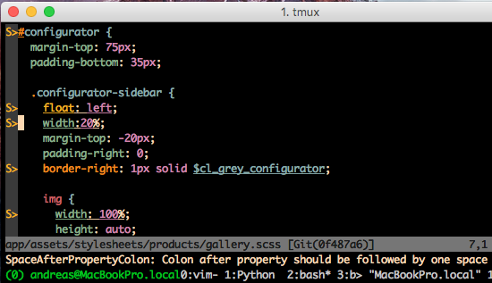
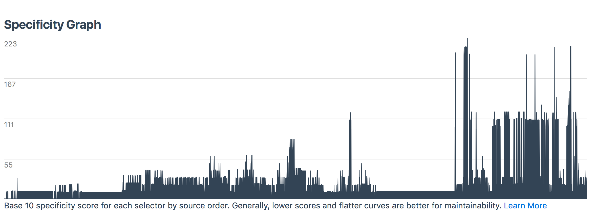

<style type="text/css">
<!--
div.footnote {
  text-align: left;
	font-size: 20px;
}
-->
</style>
# (S)CSS Lessons Learnt

## Andreas Wachowski
### October 2016

<div class="footnote">
  <p>@awachowski</p
  <p>github.com/andreaswachowski</p>
  <p>www.andreas-wachowski.de</p>
</div>


# Introduction
* Webshop Project 10/2015 — 04/2016
* Last Months: Refactoring for Responsiveness
* What are the lessons learnt regarding (S)CSS?


# Executive Summary

1. Lint
2. Organize
3. Learn

Note:
* The LOL is purely coincidental
* Time: 1:00


### The initial situation

<h1>OVEFLOW</h1>

Note:
* Time: 2:00
* Inconsistent Components (overflows with different blues, opacity or not, etc.)
* inconsistent coding-style (indentation, etc)
* pixel based layout everywhere
* fighting against Bootstrap
* lots of redundancies (e.g., repeated link styles everywhere)
* very tight coupling between markup and styling and page-oriented folder organization.


# Lesson #1: Lint
## Benefits
* Improves code readability
* Eliminates syntax errors
* Improves your SCSS knowledge


## How to lint
  1. Set it up
  2. Gather statistics and prioritize
  3. Do iterations
  4. Make it seemless


## 1.1 Linter Setup
1. Choose a linter (scss-lint, style-lint)
2. Integrate it into CI
3. Establish team consensus for rules

Note:
* Integrate it regardless of how many warnings you get. Just disable failing rules
* autoprefixer /  www.caniuse.com
* scss-lint vs stylelint?
With hindsight: Try stylelint (autocorrect)
    scss-lint vs. stylelint (https://css-tricks.com/stylelint/, https://github.com/morishitter/stylefmt)
    autocorrect


## 1.2 Gather Statistics
```
scss-lint-stats ()
{
  scss-lint | awk '{ print $3 }' | sort | uniq -c | sort -n
}
```

```bash
1 DuplicateProperty:
1 SpaceAroundOperator:
3 PropertySpelling:
... # 28 additional lines
192 SelectorDepth:
297 PropertySortOrder:
509 NameFormat:
550 EmptyLineBetweenBlocks:
```


## 1.2 Prioritize
Goal: Enable as many warnings as quickly as possible

* low-count warnings
* high-count warnings that are easy to correct


## 1.3 Improve iteratively
One commit per warning

<pre>
<code>
$ git log --pretty=format:%h:%s
...
e8e237d:scss-lint/TrailingSemicolon: terminate declarations with one semicolon
6c028d2:scss-lint/SpaceAfterComma: add space after comma in function argument
39b01b0:scss-lint/SingleQuotedStrings: prefer single-quoted strings
099ed01:scss-lint/HexNotation: lowercase hex color values
...
</code>
</pre>

Use separate merge requests for whitespace-only changes


## 1.4 Make linting seemless
1. Editor integration



&nbsp;2. Pre-commit hooks

&nbsp;3. Continuous Integration

Note:
* Time: 2:00


# Lesson #2: Organize

* In the large: Classes and files
* In the small: Inside classes


## #2.1: In the large

For details, see
* OOCSS
* SMACSS
* ITCSS
* BEM


### 2.1.1 Identify Styling Aspects
* Colors
* Typography
* Links
* Buttons
* Menus
* Grids
* ...

(Ideal goal: Build a living style guide)

Note:
* Terminology varies: modules, components, ...
* Aim for (Living) Style guides
* Architecture: small objects, single responsibility


### Use Standardized Directories

(Example: SMACSS)
<div class='left' style='float:left; width: 50%'>
Before
<pre>
<code class="hljs bash">$ ls app/assets/stylesheets
application.scss
designs
main
products
profiles
spree
staticpages
theme
user
user_passwords
</code>
</pre>
</div>

<div class='right' style='float:right;width: 50%'>
After
<pre>
<code class="hljs bash">$ ls app/assets/stylesheets
application.scss
base
layout
modules
</code>
</pre>
</div>

Note:
* Do _not_ organize CSS by page or product feature


### 2.1.2 Order rules by specificity
(No strict order, just approximately)

<div class='left' style='float:left;width: 50%'>
SMACSS
<pre>
<code class="hljs bash">base
layout
modules
</code>
</pre>
</div>

<div class='right' style='float:right;width: 50%'>
ITCSS
<pre>
<code class="hljs bash">Settings
Tools
Generic
Base
Objects
Components
Trumps
</code>
</pre>
</div>


### 2.1.2 Order rules by specificity


<div class="footnote">http://cssstats.com/</div>


### 2.1.3 Responsiveness located in modules
```
.footer {
  font-size: 1rem;

  @media (min-width: $screen-sm-min) {
    font-size: 1.2rem;
  }

  @media (min-width: $screen-md-min) {
    font-size: 1.6rem;
  }
}
```

Note:
* One may eventually wish to have responsive elements, see for example http://kumailht.com/responsive-elements/


## #2.2: In the small


### #2.2.1: Naming Basics
<div class='left-3rd' style='float:left;width: 33.3%'>
Functional

<pre><code style="text-align: center">.positive-button
</code></pre>
</div>

<div class='middle-3rd' style='float:left;width: 33.3%'>
Content-Based
<pre><code style="text-align: center">.submit-button
</code></pre>
</div>

<div class='right-3rd' style='float:right;width: 33.3%'>
Presentational
<pre><code style="text-align: center">.green-button
</code></pre>
</div>

Aim for functional naming to maximize reuse.

<div class="footnote">https://seesparkbox.com/foundry/naming_css_stuff_is_really_hard</div>


### #2.2.2: BEM

<pre><code class="hljs css">.block__element--modifier</code></pre>
<pre><code class="hljs css">.component-name__link-element--variant-id</code></pre>

Before
```
<div class="box  profile  pro-user">
  
  <p class="bio">...</p>
</div>
```

After
```
<div class="box  profile  profile--is-pro-user">
  
  <p class="profile__bio">...</p>
</div>
```

<div class="footnote">https://css-tricks.com/bem-101/</div>
<div class="footnote">https://medium.com/@drublic/css-naming-conventions-less-rules-more-fun-12af220e949b#.j0req6x0w</div>

Note:

* Use for self-contained, discrete UI parts
* Do _not_ reflect the DOM
* + HTML is easier to understand
* - Can be verbose


### #2.2.3: Don't mix JS and CSS

Separate style and behavior
```
<input type="submit" class="btn js-btn" value="Follow" />
```


### #2.2.4: Minimize specificity
Which one do you prefer? This:
```
#configurator #gallery .item.item-configurator .overlay .overlay-hover .toolbar a.like {
  display: inline-block;
}
```

… or this:

```
.toolbar-link__like {
  display: inline-block;
}
```

Avoid strong dependency on HTML structure

Note:

* Balance between style-heavy markup and markup-heavy styles


### #2.2.4: Minimize specificity

```
.pg-deadline
  &__date
    // becomes `.pg-deadline__date`
    color: $color-gray

  &__header
    // becomes `.pg-deadline__header`
    font-weight: 700

    &--highlight
      // becomes `.pg-deadline__header--highlight`
      color: $color-green
```

<div class="footnote">https://medium.com/peergrade-io/structuring-css-in-large-projects-37f1695f5ec8#.xrytjcqr9</div>


### Example: colors
<pre><code class="hljs scss">$ cat app/assets/stylesheets/base/_colors.scss
// Use these definitions only (!) inside this file:
$white: #fff;
$grey: #4a4a4a;
$bright-red: #ec2323;
$akra-red: #cc1c29;
...

// Use these definitions inside other SCSS/HAML code:
$error-color: $bright-red;
$body-background-color: $white;
$top-menu-color: $grey;
$intro-color: $white;
...
</code></pre>

<pre><code class="hljs scss">$ cat app/assets/stylesheets/modules/_intro.scss
.intro {
  color: $intro-color;
  ...
}
...
</code></pre>


## 2.3: Miscellaneous Tips


### 2.3.1 Comment your CSS
* Refactoring shall make the code _easier to understand_
* Use comments to declare _intent_
* Use _“foot”notes_ to cope with text width

```
// 1) calibrated by eye-sight to be centered below the video's
//    belt buckle
&-buttons {
  margin-left: 26.5%; // [1]
}
```

<div class="footnote">
  <ul>
    <li>https://www.sitepoint.com/how-good-are-your-html-and-css-comments/</li>
    <li>http://cssguidelin.es/#commenting</li>
  </ul>
</div>


### 2.3.2 Add a CSS Refactoring Roadmap

Add a section to the project's README.md (or a separate document) to clarify the
direction and the overall status of long-term refactorings.

Note:
* Time: 10:00


# Lesson #3: Learn
Don't underestimate the complexity.

CSS has grown big.

<div class="footnote">https://github.com/h5bp/Front-end-Developer-Interview-Questions#css-questions</div>


## How to stay up to date
Check the following for people, blogs, sites:
* https://speakerdeck.com/chriscoyier/how-to-stay-up-to-date-on-web-stuff (esp. slides 86–92)
* https://uptodate.frontendrescue.org/

For example:
* <a href="http://lea.verou.me/">Lea Verou</a> <a href="https://twitter.com/LeaVerou">@leaverou</a> (CSS)
* <a href="https://rachelandrew.co.uk/">Rachel Andrew</a> <a href="https://twitter.com/rachelandrew">@rachelandrew</a> (CSS Grid)
* <a href="https://sarasoueidan.com/">Sara Soueidan</a> <a href="https://twitter.com/SaraSoueidan">@sarasoueidan</a> (CSS and SVG)
* <a href="https://codepen.io/thebabydino/">Ana Tudor</a> <a href="https://twitter.com/anatudor">@anatudor</a> (CSS animations)
* <a href="http://zomigi.com/">Zoe Mickley Gillenwater</a> <a href="https://twitter.com/zomigi">@zomigi</a> (CSS)


## SMACSS/BEM/OOCSS/ITCSS
* https://smacss.com/
* https://en.bem.info/methodology/key-concepts/
* https://css-tricks.com/bem-101/
* https://github.com/stubbornella/oocss/wiki
* Harry Roberts – Managing CSS Projects with ITCSS:
  * 1h15m video: https://www.youtube.com/watch?v=1OKZOV-iLj4
  * Slides: https://speakerdeck.com/dafed/managing-css-projects-with-itcss
  * The talk and slides give an excellent explanation of the need to arrange rules by specificity and the specificity graph.


## CSS Style guides
* CSS Guidelines: http://cssguidelin.es/
* 18F Front End Guide, CSS: https://pages.18f.gov/frontend/#css
* Reasonable System for CSS Stylesheet Structure: https://github.com/rstacruz/rscss/tree/master/docs


## Books
* Verou, CSS Secrets, O'Reilly, June 2015, http://shop.oreilly.com/product/0636920031123.do
* Budd/Bjorklund/Hume, CSS Mastery, 3rd Edition, Apress, June 2016, http://www.apress.com/9781430258636
  (ebook to appear soon)


## Newsletters
* http://css-weekly.com/
* http://html5weekly.com/
* http://mobilewebweekly.co/
* http://webtoolsweekly.com/


## Tools
* https://github.com/brigade/scss-lint/: Popular SASS-linter
* http://stylelint.io/: Up-and coming, PostCSS-based linter. Allows some autocorrecting with https://github.com/morishitter/stylefmt
* https://github.com/postcss/postcss-bem-linter: Lint for BEM syntax


## W3C Specs
Read (and re-read) the foundations:

* Cascade and Inheritance
* Box Model
* Positioning schemes
* Also: Flexbox and (upcoming) Grid Layout modules

<div class="footnote">https://www.w3.org/Style/CSS/read, section "Learning the Foundation"</div>

Note:
* Time: 2:00


# Thanks!
